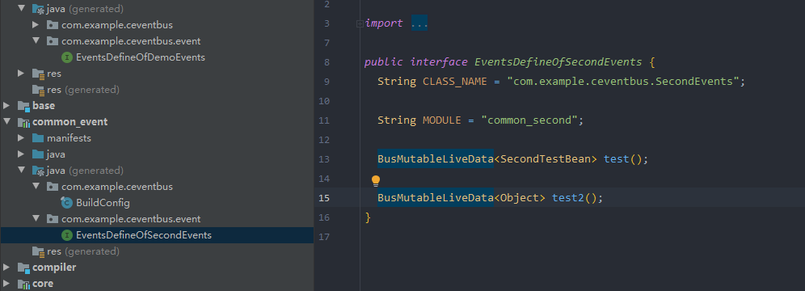

# CEventBus消息总线
[Android消息总线的演进之路：用LiveDataBus替代RxBus、EventBus](https://tech.meituan.com/2018/07/26/android-livedatabus.html)
[Android组件化方案及组件消息总线modular-event实战](https://tech.meituan.com/2018/12/20/modular-event.html)

美团文章中组件化通信消息总线设计要注意的问题和实现的思路都已经讲得很清楚，modular-event没有开源代码，本示例是对齐方案的实现，需要提下原文中几点
## 消息总线的优点和缺点
总的来说，消息总线最大的优点就是解耦，因此很适合组件化这种需要对组件间进行彻底解耦的场景。然而，消息总线被很多人诟病的重要原因，也确实是因为消息总线容易被滥用。消息总线容易被滥用一般体现在几个场景：
* 消息难以溯源
有时候我们在阅读代码的过程中，找到一个订阅消息的地方，想要看看是谁发送了这个消息，这个时候往往只能通过查找消息的方式去“溯源”。导致我们在阅读代码，梳理逻辑的过程不太连贯，有种被割裂的感觉。
* 消息发送比较随意，没有强制的约束
消息总线在发送消息的时候一般没有强制的约束。无论是EventBus、RxBus或是LiveDataBus，在发送消息的时候既没有对消息进行检查，也没有对发送调用进行约束。这种不规范性在特定的时刻，甚至会带来灾难性的后果。比如订阅方订阅了一个名为login_success的消息，编写发送消息的是一个比较随意的程序员，没有把这个消息定义成全局变量，而是定义了一个临时变量String发送这个消息。不幸的是，他把消息名称login_success拼写成了login_seccess。这样的话，订阅方永远接收不到登录成功的消息，而且这个错误也很难被发现。

## 组件化消息总线的设计目标
* 消息由组件自己定义
以前我们在使用消息总线时，喜欢把所有的消息都定义到一个公共的Java文件里面。但是组件化如果也采用这种方案的话，一旦某个组件的消息发生变动，都会去修改这个Java文件。所以我们希望由组件自己来定义和维护消息定义文件。
* 区分不同组件定义的同名消息
如果消息由组件定义和维护，那么有可能不同组件定义了重名的消息，消息总线框架需要能够区分这种消息。
* 解决前文提到的消息总线的缺点
解决消息总线消息难以溯源和消息发送没有约束的问题。

## 消息总线约束
我们希望消息总线框架有以下约束：

* 只能订阅和发送在组件中预定义的消息。换句话说，使用者不能发送和订阅临时消息。
* 消息的类型需要在定义的时候指定。
* 定义消息的时候需要指定属于哪个组件。

## 如何实现这些约束
* 在消息定义文件上使用注解，定义消息的类型和消息所属Module。
* 定义注解处理器，在编译期间收集消息的相关信息。
* 在编译器根据消息的信息生成调用时需要的interface，用接口约束消息发送和订阅。
* 运行时构建基于两级HashMap的LiveData存储结构。
* 运行时采用interface+动态代理的方式实现真正的消息订阅和发送。

## 美团消息总线modular-event的结构
* modular-event-base：定义Anotation及其他基本类型
* modular-event-core：modular-event核心实现
* modular-event-compiler：注解处理器
* modular-event-plugin：Gradle Plugin

其中modular-event-plugin主要用于扫描所有module的自定义task，这个实现网上有很多示例，所以不在这里说明，示例中仍然有其他三个模块。也有使用module通信的示例。
## 整体流程

## ceventbus的结构
* base：定义Anotation及其他基本类型
* core：event核心实现
* compiler：注解处理器

## 使用
使用前需要先make，生成接口类就可以直接使用,@EventType注解的常量内容直接翻译为接口方法名，内容因为可以重复，无法保证方法名不重复，需要用户自己注意，也可以自己改为使用常量，就可以避免

	@ModuleEvents(module = "common_second")
	public class SecondEvents {
	    @EventType(SecondTestBean.class)
	    public static final String TEST = "test";//test会变成方法名
	
	    @EventType()
	    public static final String TEST2 = "test2";
	}

生成后接口类如下

具体使用：

	SecondTestBean bean=new SecondTestBean();
    bean.v="ad";
    bean.id=2;
    CEventBus.of(EventsDefineOfSecondEvents.class).test().setValue(bean);